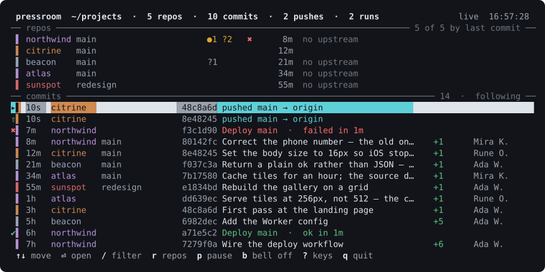

# pressroom

Every commit, push, workflow run and Cloudflare deploy landing across your git repositories, live, in one
terminal.



It walks a directory tree, finds every git repository under it — including ones nested inside plain grouping
folders — and draws them as a single timeline, newest first, as things happen. Nothing is configured: point it
at a directory and it works out the rest.

## Getting started

```sh
git clone https://github.com/anthonybo/pressroom.git
cd pressroom
npm install
npm start
```

That watches **the directory the project is installed in**, so a clone at `~/code/pressroom` watches
everything under `~/code`. Pass a path to watch somewhere else, or set `PRESSROOM_ROOT`.

To get a `pressroom` command that works from any directory:

```sh
npm link          # once, from the project
pressroom         # from anywhere
```

`npm link` puts a symlink on your `PATH` pointing back at this working copy, so the command always runs
whatever is checked out here. If you would rather not link, `bin/pressroom` can be symlinked by hand, and
`npm start -- <flags>` works from the project directory.

### Try it without pointing it at your own work

```sh
npm run demo
```

That builds a workspace of five invented repositories — with commits, pushes, a failing workflow run and a
couple of Cloudflare deploys — and runs against those instead. It is also where the screenshot above comes
from: rendered by the same components that draw the terminal, so the columns line up because they were
produced rather than typed. Nothing in it touches the network, and it lives in a gitignored `.demo/`.

Press `?` inside for the keys.

---

## Reading it

The feed is newest first, so reading a group of rows **upwards** follows one change forwards in time — written,
sent, and then judged:

```
✖▌ 16m  northwind                 f3c1d90 Deploy main  ·  failed in 1m
⇧▌ 16m  northwind                 f6f0eb2 pushed main → origin
 ▌ 17m  northwind main            f6f0eb2 Correct the phone number — the old on…    +1      Mira K.
```

A Cloudflare deploy is the same row with no sha, because Cloudflare's record does not carry one — what it
carries instead is the hostname, which is the thing you wanted to know anyway:

```
☁▌ 29m  beacon                            beacon.example.dev went live  ·  wran…
```

**Enter** opens a commit: full message, author, and every file changed with its own line counts. Enter again
opens that file's diff. On a **push** row it opens the commit that was pushed; on a **Cloudflare deploy** row
there is no commit to open, because Cloudflare's record does not carry one.

**`y`** copies something different per row, whichever is actually useful: the sha on a commit, the run's URL on
a workflow run — a failed run is something you go and look at — and the version id on a Cloudflare deploy.
macOS only, via `pbcopy`.

| glyph    | meaning                                                          |
| -------- | ---------------------------------------------------------------- |
| `▌`      | the repo's color, so one project is one stripe down the screen    |
| `✦`      | a commit that arrived since you have been watching                |
| `⇧`      | a push — which branch, to which remote, and how many commits      |
| `✔ ✖ ◔`  | a workflow run: succeeded, failed, still running                   |
| `◔ 3m`   | how long it has been running, against how long it usually takes    |
| `⊘`      | a run that was cancelled or skipped                                |
| `☁`      | a Cloudflare deploy, named by the hostname that went live          |
| `↺`      | a rollback                                                         |
| `↑3 ↓1`  | three commits not yet pushed, one not yet pulled                   |
| `●2`     | two tracked files changed but not committed                        |
| `?1`     | one untracked file — git has never seen it                         |
| `⑂`      | a merge commit                                                     |

Push, run and deploy rows keep their own glyph when they are new, and show it by weight and color instead of
swapping in `✦`.

The repo panel is ranked by last commit, so whatever you are working on is at the top of it, and it carries
**two** deploy columns rather than one:

```
 ▌ northwind main                      ●1 ?2   ✖ ☁   17m     the run failed, and a Worker is live anyway
 ▌ beacon    main                      ?1        ☁   30m     deployed by hand — no workflow to have an opinion
 ▌ atlas     main                                    43m     neither: no CI, not a Worker
```

They are two different facts and neither substitutes for the other. Showing whichever was _newer_ was the
first attempt and it was wrong structurally, not occasionally: a workflow is what runs wrangler, so an
Actions deploy always produces a Cloudflare deployment a moment after the run starts — which handed the
column to the deploy every single time and hid every pass-or-fail permanently.

`●2` counts **files**, once each. A file that was staged and then edited again is reported by git as
`MM` — it appears in both halves of the status, and adding the halves together calls one changed file two
of them.

`↑3` is often the number worth watching. If a repository deploys by pushing a branch, a commit ahead of its
upstream is finished work that exists in exactly one place — and nowhere it can be seen from.

---

## Keys

| Key                      | Does                                                                       |
| ------------------------ | -------------------------------------------------------------------------- |
| `↑` `↓` `j` `k`          | move — and stop following, so the cursor then stays where you put it        |
| `pgup` `pgdn` `^d` `^u`  | a page at a time, in the feed and in a diff                                 |
| `g`                      | follow the newest again, and mark what arrived as read                      |
| `G`                      | jump to the oldest row loaded                                               |
| `⏎` `→` `l`              | open the commit, then a file                                                |
| `esc` `←` `h`            | back out of a commit or a diff; in the feed, `esc` clears the filter        |
| `/`                      | filter on repo, subject, author, sha, branch or hostname                    |
| `r`                      | show or hide the repo panel                                                 |
| `a`                      | cycle scope: local branches → checked-out branch → all refs                 |
| `p`                      | pause — stops reading, so nothing moves while you read                      |
| `R`                      | rescan for new repos, and read every one now                                |
| `b`                      | ring the terminal bell on a new commit                                      |
| `y`                      | copy the sha, the run link, or the version id — whichever the row has       |
| `?`                      | this table, in the app                                                      |
| `q` `^c`                 | quit                                                                        |

Page keys work in the feed and in a diff; a commit's file list takes `j`/`k`/`g`/`G`. Any filter term matches
against several fields at once, so `/push main` narrows to pushes of `main`, and `/failed` to runs that failed.

---

## Options

```sh
pressroom --list          print the repos a scan finds, then exit
pressroom ~/work ~/side   watch specific directories instead
pressroom .               just the repository you are standing in
pressroom --local         commits and pushes only — no network at all
pressroom --depth 5       look deeper for nested repos (default 4)
pressroom --limit 80      commits read per repo (default 40)
pressroom --scope all     include remote-tracking refs
```

`--list` is the quick way to confirm a repo is being watched, and it works without an interactive terminal.
`PRESSROOM_ROOT` sets the root too.

### Running several at once

This is the normal way to use it — one per terminal session — and the local half is cheap: about 20–35MB
resident while active, dropping to almost nothing when idle, 0% CPU at rest, and 3 watch handles for thirty
repositories, because Node multiplexes them. Reads are read-only and run with `GIT_OPTIONAL_LOCKS=0`, so
instances never contend with each other or with your own `git commit`.

What multiplies is the network half. Every instance runs its own `wrangler` — a fresh Node process, about a
second and a half, two at a time — and they all spend from the same GitHub token, so the rate limit is one
budget however many are open. At rest that is around 100 calls an hour each against a limit of 5000, which is
fine for dozens; but an instance watching several repos through an active deploy can reach roughly 1800 an
hour, so a handful of busy sessions could approach it.

`--local` is there for that: commits and pushes only, no `gh`, no `wrangler`, nothing off the machine. A
secondary session costs only its own git reads, and the header says `local only` so it cannot be mistaken for a
workspace where nothing has ever deployed.

---

## How it works, and why it is built this way

**It never writes to your repositories.** The git subcommands used are `log`, `status`, `show`, `rev-list` and
`config --get` — all readers, all routed through one function, so the claim is checkable rather than taken on
trust. Every one runs with `GIT_OPTIONAL_LOCKS=0`. That variable exists for exactly this case: it
stops `git status` from taking `index.lock` to write back a refreshed index. Without it, a dashboard polling
thirty repos will now and then hold the lock at the moment you run `git commit`, and the error you get
looks like your own git breaking.

**Commits are noticed, not polled for.** Each repo has `fs.watch` on its git directory, its `refs/heads` and
its `logs/`, which is how a commit shows up in a fifth of a second. Watches are registered on _directories_,
never on a ref file: git updates a ref by writing `main.lock` and renaming it over the target, so a watch
held on the path `refs/heads/main` is holding an inode that no longer exists after the first commit — it
stays open, reports nothing, and looks exactly like a repo where nobody is working.

A poll runs underneath anyway, tiered by how recently each repo was committed to — three seconds for one
touched in the last hour, five minutes for an archive. Editors, network filesystems and `git gc` all have
ways of producing changes that FSEvents coalesces or drops, and the poll turns a missed event into a few
seconds of delay rather than a row that never updates again.

**Two sources, because they are two different facts.** Pushing a branch triggers GitHub Actions, and the
workflow is what runs `wrangler deploy` — so the Actions run is the thing worth watching. Asking Cloudflare
directly would report a deploy that succeeded while knowing nothing about one that was attempted, and most
failures happen before wrangler is reached at all, in the build or the checks.

It reads them through `gh`, which already holds a token in your keychain, so pressroom stores no credential
of its own. Along with the Cloudflare read below, it is one of only two parts of the program that leave the
machine — `--local` turns both off — and it asks about as little as it can: of the 23 repos on the workspace
this was built against, only 5 contained `.github/workflows`, and an `existsSync` for that directory removes
the other 18 from every polling round. A repo with a deploy in flight is checked every ten seconds — that is
when you are actually waiting on it — one committed to in the last five minutes every twenty, and everything
else once every two minutes. If `gh` is missing or logged out, deploy rows are simply absent and the reason is
reported once rather than retried forever.

A deploy is one row that updates in place as it moves from queued to a conclusion, and it announces itself
more than once on purpose: when it appears, again if it was caught while still queued and has now started, and
again when it finishes. The last is the one that matters, and because the row is placed at the time the run
_started_ — next to the push that triggered it, rather than jumping to the top on every poll — the flash and
the bell are what draw your eye to a deploy that has just gone red.

**Cloudflare is asked separately, because a workflow run is not the whole story.** On the workspace this was
built against, four of the seven Workers deploy through Actions; the other three are deployed by running
`npm run deploy` on the laptop, which calls `wrangler deploy` directly and never touches GitHub. Those had no
workflow run to observe and were completely invisible here.

They are different facts even where both exist. A green Action says the pipeline finished; a Cloudflare
deployment says the Worker version actually changed — and a run that succeeds while skipping its deploy step is
green and has changed nothing. So both are shown, and a deploy row names the **Worker**, which is not the repo:
`example.dev` deploys `example-dev`, and `demo` deploys `web-demo`.

**A repo is more than one Worker, and the hostname is the point.** The branch decides where a push goes,
and that is implemented as two _separate_ Workers rather than two variants of one — one Worker serves one
version to every route it owns, so two hostnames showing different builds is not something routes can
express:

| repo          | production                      | review                                      |
| ------------- | ------------------------------- | ------------------------------------------- |
| `gallery`     | `gallery` → gallery.example.dev | `gallery-dev` → gallery-dev.example.dev     |
| `example.dev` | `example-dev` → example.dev     | `example-dev-staging` → staging.example.dev |
| `demo`        | `web-demo` → demo.example.dev  | `web-demo-dev` → demo-dev.example.dev      |

Reading only the top-level `name` therefore missed every review deploy. Both are asked about now, and each
row is labelled with the hostname from that environment's routes rather than the Worker name — that
`staging.example.dev` went live and that `example.dev` went live are the distinction worth seeing, and the
Worker names behind them are confusingly similar. A Worker named in a config that has never been deployed
answers `does not exist on your account [code: 10007]`, which is treated as "nothing here yet" and skipped
rather than as a broken setup.

It asks with **each project's own** `node_modules/.bin/wrangler`, so pressroom does not depend on wrangler,
never invokes `npx` (which would happily download one), and asks with the version that project deploys with.
Only `deployments list` is ever run — there is no code path here that can deploy, roll back or change
anything. A wrangler start costs about a second and a half, so the Cloudflare poll is the slowest of the three — but
it is mostly a fallback now, because both ways a deploy can happen announce themselves:

**A deploy from this laptop touches `.wrangler`.** Measured three seconds before the deployment Cloudflare
records, so that directory is watched and a local `npm run deploy` is asked about at once.

**A deploy from CI is a workflow that just ran wrangler.** So a run reaching a conclusion pulls the
Cloudflare check forward for that repo rather than leaving it to the schedule.

Both exist because the tiers alone were wrong, and wrong in a way that took a report to notice: the signal
for "is this repo busy" was the last **commit** date, and a deploy has no particular relationship to a recent
commit. A deploy went out ten minutes after its push, by which time the repo counted as idle and the interval
had relaxed to 180 seconds — so the row appeared three minutes after the site did. The schedule is now the
safety net for the case neither trigger covers: a deploy made from the Cloudflare dashboard, or from another
machine.

If `CLOUDFLARE_API_TOKEN` is set and the call is refused, it is retried once with the variable removed —
which is what `unset CLOUDFLARE_API_TOKEN` does by hand, and the same trap that once read as a Cloudflare
outage for an hour.

The sha column is deliberately **blank** on a Cloudflare row. There is no commit sha in Cloudflare's record,
and the version id it does have is a UUID whose first seven characters look exactly like a short git sha —
printing it there would invite a `git show` on something git has never heard of. `y` copies it instead.

A running deploy reads as `running 3m  ·  usually 5m 30s`, and turns red once it is well past that.
"Running" on its own cannot be interpreted: a `gallery` deploy takes five and a half minutes because it
drives headless-browser checks across four site designs, while `demo` and `starter` finish in about one — so the
same three-minute-old row is unremarkable for one repo and overdue for another. The expectation is the median
of that workflow's recent **successful** runs, because a deploy that died in thirty-nine seconds is not
evidence about how long the work takes. Overdue requires both twice the usual _and_ a full extra minute, so
doubling a fifteen-second run does not cry wolf — and an overdue run keeps its clock glyph rather than
becoming a cross, because it is late, not failed.

**Pushes come from the reflog, not from watching shas move.** Pushing writes an entry to the
remote-tracking ref's reflog whose message is `update by push`, and a fetch writes to the same reflog with a
different message. Reading the message is what keeps someone else's commits arriving via `git pull` from
being reported as something you pushed — and because the reflog carries its own timestamps, pushes made
before pressroom was launched still appear, at the time they actually happened. One
`git log -g --remotes` per repo covers every remote branch at once.

**Rewritten history disappears.** Each read replaces everything known about that repo rather than appending
to it, so `--amend`, a rebase or a `reset --hard` removes the old commits from the feed instead of leaving
them there forever, indistinguishable from commits that still exist. What is preserved across reads is when
pressroom first _saw_ each commit — that cannot be derived from the commit itself, because a rebased branch
is full of commits authored last week that arrived a second ago.

**The feed sorts on committer date, not author date.** They differ precisely when history is rewritten, and
then the committer date is the one a live dashboard wants: a rebase of Monday's work should appear now, not
filed into the middle of last week where nobody would see it.

**Nothing from a commit reaches the terminal unsanitized.** A subject, a branch name and a filename are all
arbitrary text chosen by whoever made the commit, and a terminal interprets escape sequences —
`git commit -m $'\e[2J'` would clear the screen when the row was drawn. Escape sequences and control
characters are stripped before any of it is rendered.

---

## It has to survive being left open

An earlier version died after about three hours with a four-gigabyte heap. The cause was not this program's
code: React's **development** build reports to the User Timing API on every render, Node buffers those entries
for the life of the process, and nothing evicts them — about 350 `PerformanceMeasure` objects a second, some
fifteen megabytes a minute. `src/index.ts` therefore selects React's production build before anything imports
React, which is why that file contains no JSX; `run.tsx` also clears the performance timeline periodically, so
running under `NODE_ENV=development` costs a little work instead of crashing.

`npm run probe` is what found it and what confirms it stays fixed:

```sh
npm run probe -- engine     # the watching and reading, with no UI
npm run probe -- ink        # the same, with the real render attached
```

It forces a full GC before each measurement, so what it prints is retained memory rather than garbage waiting
to be collected. Engine-only was flat throughout, which is what localized the leak to the render path in the
first place. `scripts/heapdiff.mjs` aggregates two heap snapshots by object type and reports what grew
between them, which is what named the culprit.

## Walking away and coming back

The feed has two modes, and which one it is in is stated on the rule rather than left to be inferred:

**Following** (`following` on the rule) is the default, so left alone this behaves like a live feed: the cursor
sits on the newest row and moves to whatever becomes newest.

**Held** starts the moment you press any movement key. The cursor is then yours: selection is by the commit
itself, not a row number, so arrivals above it change its position in the list without changing what is
selected — and the row stays where it is on screen rather than sliding under you. `g` goes back to following.

Those being one thing rather than two was a bug worth recording. "No commit explicitly selected" was treated
as "follow the newest", which meant sitting on the top row — without having pressed anything, which is most
of the time — let every arrival take the cursor with it. Being _on_ the newest row and _following_ it are
different things, and only one of them should move.

What that leaves is the opposite problem: the new rows are pushed above the fold, and the `✦` freshness flash
fades after twelve seconds. Right while you are watching; useless if you step away for five minutes and come
back to a screen with nothing on it to say what landed.

So the moment the cursor leaves the newest row, a mark is set, and everything arriving after it stays marked
until you go back to the top:

```
── commits ─────────────────────────────── 10  ·  ↑ 2 new above ──
 ▌ 11s  watched   2459c16  History commit number 3          +1
 ▌ 11s  watched   31db990  History commit number 6          +1
▸▌ 12s  watched   d6a692b  History commit number 1          +1
 g 2 new — jump   ↑↓ move   ⏎ open   / filter   …
```

Marked rows keep their `✦` and their weight for as long as it takes. The rule says whether the new rows are on
screen (`2 new`) or scrolled off it (`↑ 2 new above`), because those call for different things — read them, or
press `g`. The footer offers `g` whenever there is something to go back to, and pressing it clears the marks,
since going to look at them is what makes them read.

A deploy is judged on when its **state** changed rather than when its row appeared, so a build that went red
while you were away is marked even though the run itself started before you left.

## New repos appear on their own

The set of repositories is re-scanned every 30 seconds, so a repo created after launch shows up without a
restart — which matters here because spinning up a client _is_ creating a repo. A full scan of thirty repos
measures 12ms, so the timer costs nothing. `R` rescans immediately.

A repo that appears is watched straight away, on all four fronts: commits, pushes, workflow runs and
Cloudflare deploys. A repo that is deleted stops being watched and its rows leave the feed, because leaving
them there asserts the existence of something that is gone.

Two things this has to get right, both of which would be invisible until they bit:

**A newly discovered repo brings history, not news.** Its commits arrive as baseline, exactly as at startup —
otherwise creating a client repo with any prior history would flood the feed with every commit ever made in
it, and ring the bell for each one.

**Labels are stable once assigned.** The feed is keyed by label, so re-deriving names on every scan is
correct in isolation and wrong in motion: adding a second `demo` would requalify the _existing_ one from
`demo` to `acme/demo`, change every key belonging to it, and re-announce its whole history as if it
had just arrived. So the first scan names the set symmetrically and later scans only name repos they have not
seen before — an incumbent keeps its short name and a colliding newcomer gets qualified. Asymmetric, but a
stable name that is slightly less tidy beats a tidy one that moves under the feed. Restarting normalizes it.

## Color

Every color is an explicit value, and `npm run check:contrast` measures all of them against a black _and_ a
white terminal.

The first palette used chalk's `gray` for all secondary text, which turned out to be the whole problem:
`gray` is not a color, it is ANSI palette slot 8 — "bright black" — and its actual value is whatever the
terminal theme decides. On a dark theme that lands a few percent off the background, and it was carrying the
age, the sha, the branch, the author, every rule and the entire footer. Most of the screen, in the one color
you cannot read.

The replacement is two tiers rather than one, because "dim" was doing two jobs: `muted` (#9aa2ad, 8.2:1 on
black) for text that is secondary but still read, and `faint` (#6e7681, 4.6:1) for chrome that only has to be
visible. The brightest tier is deliberately **not** a color at all — a near-white that reads well on black
measures 1.22:1 on white, so it is left undefined and the terminal's own foreground decides, with weight
carrying the emphasis.

The neutrals are the only colors held to both ends, since they carry nearly all the text. The hues are
dark-terminal-first and merely kept discernible on a light one: no single value is vivid on black and legible
on white at once, and forcing them all into the band where both hold produced a screen of washed-out
mid-tones. Nothing depends on a hue alone — `+42`, `✔`, `pushed` and `went live` each say in text what the
color says in passing.

`npm run colors` renders a real frame and prints the escape codes that were actually emitted, because the
theme naming a hex does not prove the terminal received one — chalk decides that from what it thinks the
terminal supports. It fails if palette slot 8 appears again, and also if it captures nothing at all, since a
check that measured nothing must not report success.

## Checks

```sh
npm run check        # types, 127 tests, and the contrast gate
npm run frames       # renders the real UI at three terminal sizes and measures the result
npm run colors       # prints the escape codes a real frame actually emits
npm run probe        # watches memory over time, with a forced GC before each reading
npm run screenshot   # regenerates docs/screenshot.svg from the demo fixture
```

`npm run frames` exists because a screenshot proves nothing about a width. It renders into a terminal that
does not exist, at 80×24, 100×40 and 200×50, then measures every line — a row one column too wide makes ink
redraw the next frame in the wrong place and the display walks down the screen, and a frame one line too
tall scrolls the header away. Both are invisible on whatever terminal happens to be open. It takes keys too,
so the commit and diff panes are checked the same way:

```sh
npm run frames -- --cols 100 --rows 24 --keys enter,enter
```

The test suite covers the git output parsers against real output shapes, the feed's behavior under amends
and rebases, and the column and row arithmetic. `src/engine.test.ts` is the one that matters most: it makes
real commits in temporary repositories and asserts they are reported within two seconds — deliberately
tighter than the poll interval, so that if the filesystem watch ever stops working the test fails instead of
the poll quietly covering for it.
